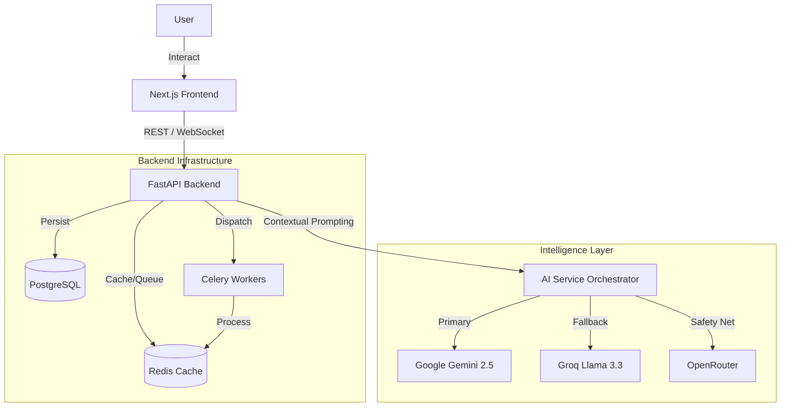
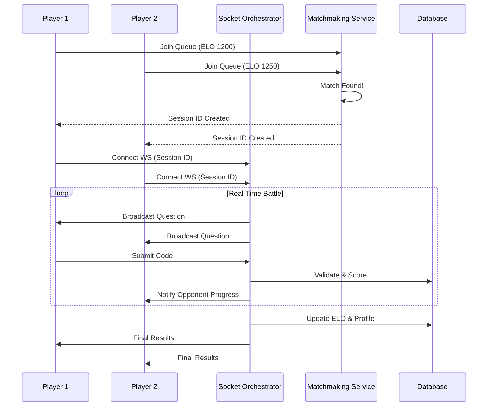

<div align="center">
  
  <h1>NxtDevs</h1>
  <p><strong>Algorithmic Thinking Trainer & Adaptive Learning Platform</strong></p>
  <p>
    A comprehensive system profiling cognitive patterns to identify biases and provide personalized coaching.
  </p>
  <p>
    
    
    
    
    
    
    
    
  </p>
</div>

---


## System Overview

**NxtDevs** is an advanced algorithmic training platform designed to go beyond simple syntax verification. It utilizes a **multi-dimensional profiling engine** to track user cognition across 20+ "Thinking Axes," identifying specific cognitive pitfalls such as "Greedy Bias" or "Premature Optimization."

Unlike standard coding platforms, NxtDevs integrates **real-time competitive duels**, **generative AI coaching**, and **deep analytics** to foster genuine problem-solving growth.

> "We don't just check if your code works; we analyze *how* you think."

---

## Key Technical Features

### Cognitive Profiling Engine
- **Multi-Dimensional Tracking**: Profiles users on axes like *Constraint Sensitivity*, *Edge Case Paranoia*, and *Asymptotic Intuition*.
- **Bias Detection**: Heuristic evaluation of submission history to detect patterns like over-reliance on Brute Force or premature optimization.
- **Adaptive Remediation**: Automatically assigns problems that target your specific cognitive weak points.

### LeetCode Integration & Analytics
- **GraphQL Data Sync**: Direct integration with LeetCode's GraphQL API (`backend/services/leetcode_service.py`) to fetch submission history, calendars, and problem tags.
- **Pattern Analysis**: Heuristics engine that scans your LeetCode history to identify strengths (e.g., "Strong Graph Intuition") vs weaknesses (e.g., "Greedy Bias Detected").
- **Smart Recommendations**: Correlates your LeetCode difficulty distribution with internal metrics to recommend optimal training sets.

### Real-Time Distributed Dueling
- **WebSocket Orchestration**: Custom-built `backend/engine/orchestrator.py` handles state synchronization between players with sub-50ms latency.
- **ELO Matchmaking**: Proprietary matchmaking queue (`backend/services/matchmaking.py`) that pairs users based on skill bands (Δ < 300 ELO).
- **Live State Sync**: Bidirectional communication ensuring fairness and instant feedback during 1v1 battles.

### Resilient AI Pipeline (Not a Wrapper)
- **Multi-Provider Fallback**: A robust engineering layer (`backend/services/ai_service.py`) that ensures 100% uptime by cascading requests: **Gemini 2.5 → Groq (Llama 3) → OpenRouter**.
- **Data-Driven Synthesis**: We use LLMs strictly as a *reasoning engine*. We feed raw execution metrics, error logs, and historical bias data to generate structured, JSON-based learning curriculums.
- **Structured Output**: AI generates actionable plans, not just chat.

### Enterprise-Grade Architecture
- **Async Task Queue**: Uses **Celery & Redis** for heavy background processing (report generation, batch stats syncing).
- **Scalable Database**: **PostgreSQL** with **SQLModel** (SQLAlchemy + Pydantic) for type-safe, high-performance data access.
- **Modern Frontend**: **Next.js 16 (App Router)** with TypeScript and TailwindCSS for a performant, type-safe UI.

---

## System Architecture

### High-Level Data Flow



### Dueling Sequence



---

## Technology Stack

### Backend
| Component | Technology | Role |
|-----------|------------|------|
| **Core** | **Python 3.11** | High-performance, type-hinted application logic |
| **API** | **FastAPI** | Async REST API & WebSocket handling |
| **ORM** | **SQLModel** | Database modeling & interaction |
| **Queue** | **Celery** | Distributed task processing |
| **Broker** | **Redis** | Message broker & caching layer |
| **AI** | **Gemini / Groq** | Logic & Reasoning Engines |

### Frontend
| Component | Technology | Role |
|-----------|------------|------|
| **Framework** | **Next.js 16** | Server-Side Rendering & App Router |
| **Language** | **TypeScript** | Strict type safety |
| **Styling** | **Tailwind CSS** | Rapid UI development |
| **State** | **Zustand / Hooks** | Complex state management |
| **Viz** | **Recharts** | Data visualization for cognitive profiles |

---

## Project Structure

```text
NxtDevs/
├── backend/
│   ├── api/             # API Route handlers (Auth, LeetCode, Duels)
│   ├── engine/          # Core scoring, dueling, and orchestration logic
│   ├── models/          # Database schema (SQLModel)
│   ├── services/        # Business logic (AI, Matchmaking, Stats Sync)
│   ├── celery_app.py    # Celery worker configuration
│   └── main.py          # FastAPI entry point
├── frontend/
│   ├── app/             # Next.js App Router pages
│   ├── components/      # Reusable UI React components
│   └── lib/             # Shared utilities
└── docker-compose.yml   # Container orchestration
```

---

##  Installation & Deployment

### Docker (Recommended)

To build and run the entire stack:

```bash
docker-compose up --build
```

### Manual Setup (Dev)

**1. Backend**
```bash
cd backend
python -m venv venv
source venv/bin/activate  # or .\venv\Scripts\activate
pip install -r requirements.txt
uvicorn backend.main:app --reload
```

**2. Worker**
```bash
celery -A backend.celery_app worker --loglevel=info
```

**3. Frontend**
```bash
cd frontend
npm install
npm run dev
```

---

## Contributors / Co-Founders
- Kush Kapoor
- Naman Jain
- Krish Jha

---

## License

Copyright © 2026 NxtDevs. All Rights Reserved.
Proprietary software.
